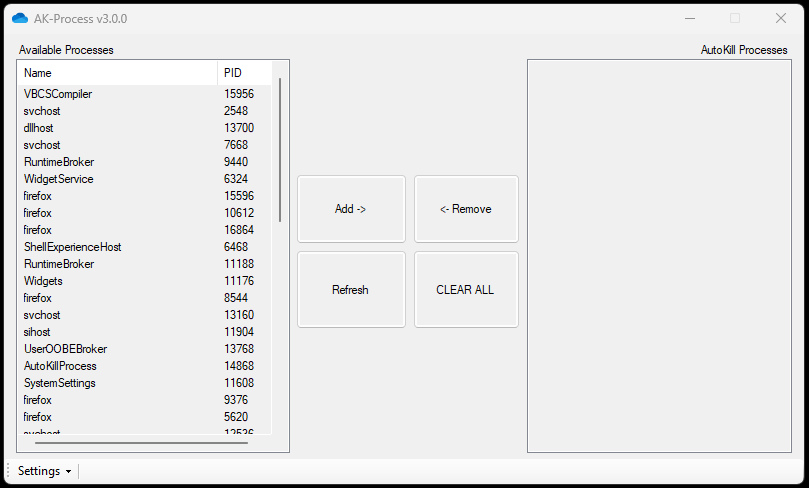

# Auto Kill Process
> Automatically keep those pesky processes killed!

# ***Installation***
1. Download and unzip from [releases](https://github.com/BrandoTheDev/AutoKillProcess/releases/download/v3.0.0/AutoKillProcess.exe)
2. Move the program to where you like
3. Double click AutoKillProcess.exe
4. Enjoy

You can select multiple running processes (left box) at once.

# ***Final thoughts***
> Added a ghetto but usable Light/Dark mode in the settings menu (also new).

> Very fun little project. Originally made it to keep Cortana and msedge from running.

> Obviously you can kill any process you have the rights to so watch what you add!
